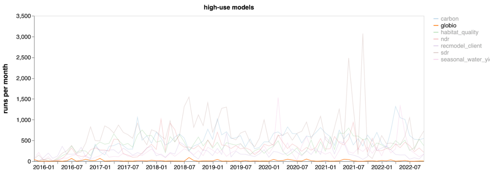

[This PEP has been modified from the origainl PEP Google Doc](https://docs.google.com/document/d/1w_B0GYc4TPR4wARbRC3satC3H7w9RT9woIfXBl1Fyh4/edit?usp=sharing)

# Platform Enhancement Proposal: Deprecate the GLOBIO model

## Contacts

Software Team, primary contact Emily Soth (esoth@stanford.edu)

## Abstract

This is a proposal to deprecate the InVEST GLOBIO model.

As described below, I argue that this model meets all the deprecation criteria.
But the primary argument for deprecating this model is that it’s been made obsolete.
Earlier this year, PBL Netherlands (the creator of GLOBIO) published an open
source command line tool for GLOBIO. It’s hard to justify continuing to
maintain our outdated implementation when a reference implementation (i.e.,
a definitive version reflecting the designers’ intent) is available.

## Motivation

**Criteria for evaluating models or tools to be deprecated:**
   * ES science credibility: has the science changed/advanced such that this
     no longer represents our current understanding
      * **The InVEST model implements an outdated version of GLOBIO.** GLOBIO is a
        biodiversity model published by PBL Netherlands Environmental Assessment Agency.
        The InVEST GLOBIO model is an implementation of GLOBIO version 3
        (paper published 2009). PBL has since released multiple minor version
        updates (3.x), and then a version 4 in 2019.
      * **It no longer provides new functionality.** An open source GLOBIO4 command
        line tool is now available to install from the
        [GLOBIO4 source code repository on GitHub.](https://github.com/GLOBIO4/GlobioModelPublic)
        Since that was made available, the InVEST model
        no longer meets the novelty criteria for a new model. [a]
      * A GLOBIO3 reference implementation may have once been available, but I
        wasn’t able to find it online. The InVEST GLOBIO model was created
        because at the time, the reference GLOBIO tool was difficult to run
        and/or didn’t fit into existing workflows. It’s not clear if it would
        meet our criteria for a new model today.

   * User demand: actionability of information for application/uptake, current
     usage stats - how “popular” of a model is it?
      * Usage logging: Per our usage logging statistics, GLOBIO is **one of the
        least used models**. Only Wave Energy, and Urban Stormwater (which has
        been around for less than a year), have had fewer runs. This chart
        shows monthly GLOBIO runs over time compared against highly used models.
      * It’s also worth noting that we have not received any requests to
        update the model, even though it’s been out of date for a decade.

   

   * Science support available - does anyone on staff have the knowledge/expertise
     to maintain and answer questions
      * **Science and software support is lacking**. The [InVEST Model Supporters
        page](https://github.com/natcap/invest/wiki/InVEST-Model-Supporters)
        lists Becky as the primary contact for GLOBIO. I've reached out to
        get her opinion, and she supports deprecating the model. Parts of the
        model documentation and user guide are unclear, and the software team
        doesn’t understand it well enough to make significant updates or refactor
        the code if that were needed.
   * Software team burden: user support required, how broken is it, what % time
     is required to maintain it 
      * Very little user support is required because the model is rarely used.
        There are just 4 questions tagged with GLOBIO on our forum. The last
        was almost a year ago.
      * There are three open issues related to GLOBIO:
         * It expects that specific LULC codes 8 and 9 will be provided
           ([#771](https://github.com/natcap/invest/issues/771))
         * It only accepts .tif and .shp inputs
           ([#632](https://github.com/natcap/invest/issues/632))
         * The test suite is inadequate
           ([#409](https://github.com/natcap/invest/issues/409))
      * Some maintenance and updates require modifying all models, so keeping
        this model around has an ongoing cost.

## Support
Deprecating this model will slightly reduce the long term maintenance and support
required for InVEST and the user’s guide, as well as translation.

## References
_Original GLOBIO 3 paper_: 
Alkemade, R., van Oorschot, M., Miles, L. et al. GLOBIO3: A Framework to
Investigate Options for Reducing Global Terrestrial Biodiversity Loss.
Ecosystems 12, 374–390 (2009).
https://doi-org.stanford.idm.oclc.org/10.1007/s10021-009-9229-5

_GLOBIO 4 paper_:
Schipper, AM, Hilbers, JP, Meijer, JR, et al. Projecting terrestrial
biodiversity intactness with GLOBIO 4. Glob Change Biol. 2020; 26: 760– 771.
https://doi-org.stanford.idm.oclc.org/10.1111/gcb.14848

### Google Doc comments
[a] This seems the main reason for deprecation: if there is an open source,
scriptable version provided by PBL, who are the main developers, it seems
futile for us to maintain an outdated parallel version.
