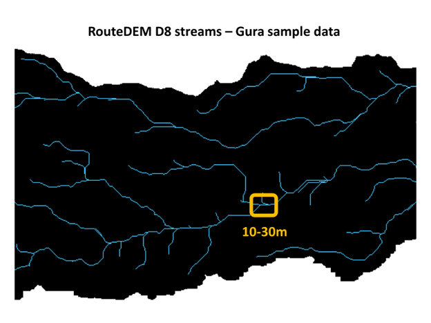
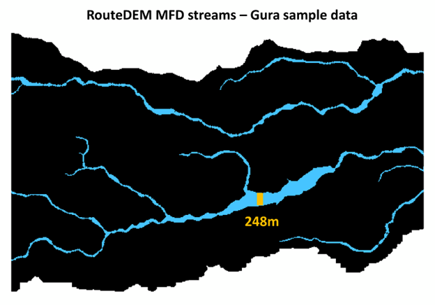
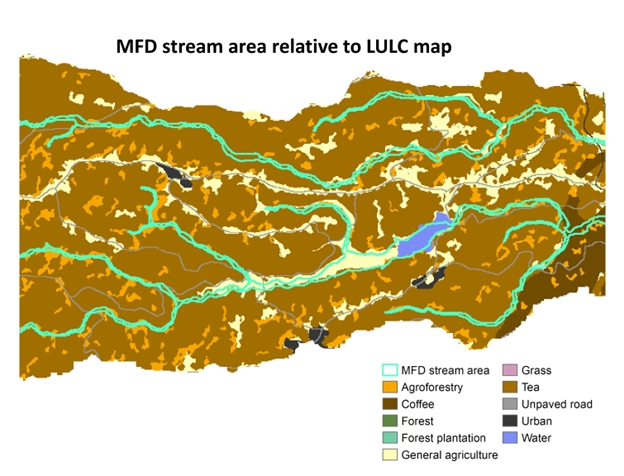

[This PEP has been modified from the origainl PEP Google Doc](https://docs.google.com/document/d/1cyqcHuyhtW3-IkJVdzNDamJx90I4k1raDJRKzrfv6eM)

PEP template Version 0.2 approved by PSC on Oct. 30, 2020

Platform Enhancement Proposal (PEP)

# Supporting both D8 and MFD algorithms in InVEST routed models and tools

Note: Expect iteration on this to get to the right level of detail
necessary to assess the science/software complexity of the request.

See the PEP guidelines
[here](https://docs.google.com/document/d/1GOZKXsNfP7PHTjhKRgzx6bmcJHwOloyrSDvkOfx7fhk/edit?usp=sharing)
for the criteria by which PEPs will be evaluated.

# Contacts

Stacie is the main contact, with input from James, Dave, Rafa, Lisa and
Jesse.

# Abstract

The routed freshwater models (Seasonal Water Yield (SWY), Nutrient
Delivery Ratio (NDR), and Sediment Delivery Ratio (SDR)) and related
tools (DelineateIt (DI) and RouteDEM (RD)) are not consistent in their
use of routing algorithm. This PEP would make these models and tools
consistent, and enhance functionality, by updating them all to provide a
user-selectable option between D8 and multiple flow direction (MFD)
routing algorithms.

# Motivation

As of InVEST 3.13.0, the routed freshwater models (NDR, SDR, and SWY)
use the MFD routing algorithm, and do not provide any other algorithm
options. Meanwhile, DelineateIt only uses the D8 algorithm, and does not
provide any other options, and RouteDEM provides the option to use
either MFD or D8.

Along with simply being inconsistent, these differences lead to several
practical issues. Importantly for modeling, when using DelineateIt to
create watersheds that are input to a routed freshwater model, it is
possible/likely that its D8 algorithm creates streams and derivative
watersheds that are different from the freshwater model's MFD result.
This would then cause a spatial mismatch between the watershed input and
the hydrologic network generated by SWY/NDR/SDR, and thus lead to
erroneous aggregated results.

It's also confusing for users. The algorithm difference between tools
has come up several times on the User Forum, for example
[here](https://community.naturalcapitalproject.org/t/in-the-swy-model-is-it-possible-to-use-simple-d8-flow-direction-instead-of-mfd/1791)
and
[here](https://community.naturalcapitalproject.org/t/why-ndr-model-generate-streams-bigger-than-routedem/2028).

There are reasons to support both algorithms. MFD had historically been
adopted for the freshwater models, since conceptually MFD provides a
better representation of hydrologic processes than D8. But some seminal
papers have shown that there is little to no benefit of MFD for medium
resolution DEMs (on the order of 10s of meters), which is the resolution
most often used for InVEST modeling. MFD can be useful to create a good
water mask because it spreads flow out nicely over flat areas such as
lakes and broad stream channels. However, this same spreading comes with
negative effects, often creating streams that are much wider than
reality (especially when considering that a pixel is usually at least 30
meters in width). Not only does this look visually incorrect in
resulting maps, but it's usually the case that there is no model output
within the stream network, so we are missing results in the very
important riparian zone, and sometimes over very large areas of the
landscape. This makes it difficult, if not impossible, to model riparian
buffers in a land cover scenario (which is commonly done), with any hope
of being realistic relative to the actual landscape, or the land
use/land cover map. This problem has come up several times during the
course of NatCap projects, and has been asked about [on the user
forum](https://community.naturalcapitalproject.org/t/riparian-buffer-values-issues-because-of-ndr-output-streams-wider-than-in-reality/2269).

D8 is standard in hydrology modeling, and generally creates streams that
are much thinner, by definition 1 pixel in width, which is what users
expect, as well as allowing for better representation of the riparian
zone. There is an existing related GitHub enhancement - [Allow
DelineateIt to do MFD watershed
delineation](https://github.com/natcap/invest/issues/440) -
which includes "In practice when we\'ve published global results run
with MFD we\'ve had to re-run them with D8 to be comparable to others."
So providing the option to choose between algorithms, and documentation
to help users choose, will allow us to select the option that is better
suited to our modeling purposes, and provide compatibility with
non-InVEST models.

Following is a comparison of the stream network created by RouteDEM with
D8 and MFD, same DEM and threshold flow accumulation, in our Gura sample
data watershed. The D8 streams are 1-3 pixels in size, while the MFD
streams are much wider, which doesn't match reality. Also note that the
networks look somewhat different, so the difference in algorithm affects
not only the width, but also the stream shape and tributaries. The third
image shows the area of MFD streams overlaid with the land use/land
cover map, illustrating how much of the landscape will end up with
modeled NoData values within the MFD stream network.

As an enhancement to existing models, this PEP follows these Guidelines:

-   **Actionable**: Applies to some of our most-used models.

-   **Credibility**: The D8 algorithm is very commonly used for
    > hydrologic modeling, and users have specifically asked for a D8
    > option, due to it being a standard, and its creation of a
    > narrower/more intuitive stream network.

-   **Generalizability**: Either algorithm may be used with any DEM in
    > any area of interest.

-   **Feasibility**: InVEST code already exists for implementing both D8
    > and MFD algorithms, and RouteDEM already provides the option to
    > choose between them in the Workbench user interface.

# Support

The InVEST User Guide chapters for all 5 tools will need to be updated
to reflect the algorithm options, provide examples, and note the pros
and cons of each. This is a one-time task.

Maintaining parallel implementations of custom routing functions in
InVEST will require additional maintenance effort over the long term.

Providing both routing options may reduce NatCap analyst and software
team time needed to explain the current limitations/mis-match and
workarounds on the forum.

No additional support is anticipated, beyond current InVEST, User Guide,
and user forum maintenance.

# Specification

The following software changes would need to be implemented for the SWY,
NDR, and SDR models, as well as DelineateIt:

-   Add the option to choose between MFD and D8 algorithms to their
    > Workbench interface.

-   Modify model code to implement the user-selected algorithm within
    > each model.

User Guide chapters for SWY, NDR, SDR, DI, and RouteDEM:

-   Update text in the Data Needs section to reflect the new input
    > options (RouteDEM already has this).

-   Create a new section called something like Routing Algorithm
    > Selection with example graphics to illustrate the difference in
    > stream networks generated by each algorithm, and noting the pros
    > and cons of each.

## Technical Details

The code for both MFD and D8 already exists in InVEST, as does code that
provides the option to choose between the algorithms in the Workbench
interface. However,

-   The D8 InVEST model implementations were made some time ago, which
    > means that they are out of sync with the last few years\' changes
    > to the routed models including the major update to sediment
    > deposition. So this will need to be updated by the software team.

-   The D8 InVEST model implementations do not have software tests. The
    > software team will need to add some when this becomes available in
    > InVEST.

-   DelineateIt is currently only available with the D8 algorithm. An
    > MFD watershed delineation routine will need to be written and
    > tested by the software team.

Specific changes that will need to be made include:

-   \[InVEST\] Updates to the routed models (SDR, NDR, SWY) to:

    -   Allow the user to select their choice of routing model: D8 or
        > MFD

    -   Update custom routed model functionality to add D8 versions

    -   Write software tests to cover the new D8 functionality in
        > addition to the MFD

-   \[InVEST User Guide\] Update the documentation around this change

    -   Which routing model should be selected? What are the tradeoffs
        > with each routing model? (Stacie will do this).

    -   Add the new invest_spec RST directive to the models' RST so that
        > MODEL_SPEC descriptions can be pulled in.

    -   Coordinate with translation teams to update the user's guide for
        > these changes.

-   \[pygeoprocessing\]

    -   Implement and test an MFD version of watershed delineation.

# Open Issues

None known at this time.

# References
